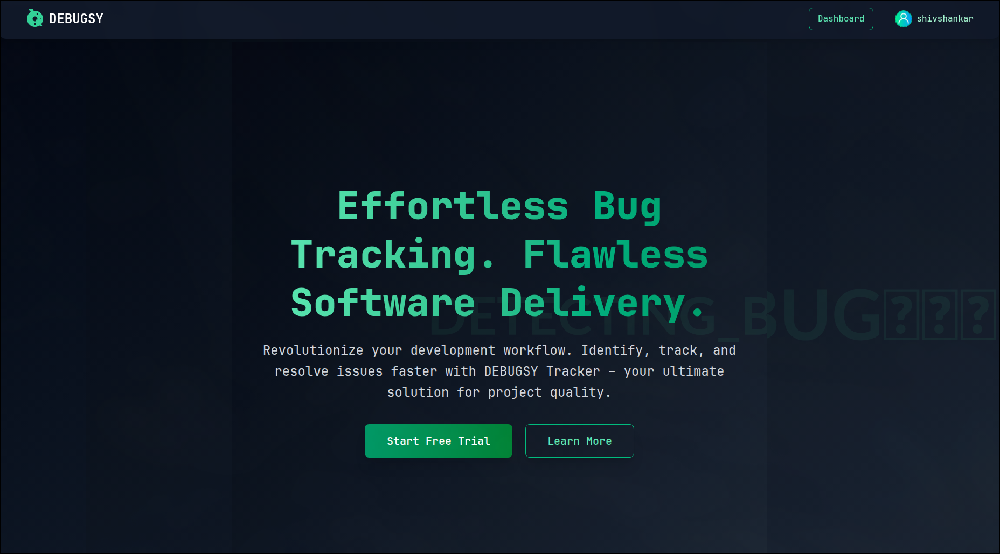
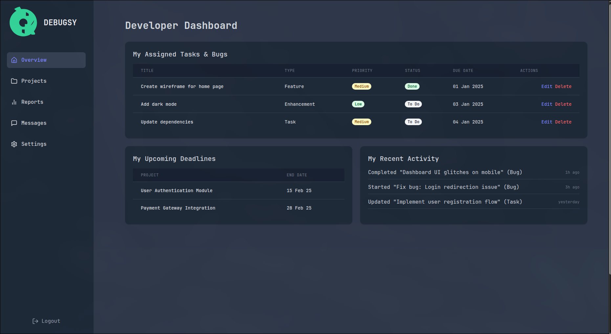
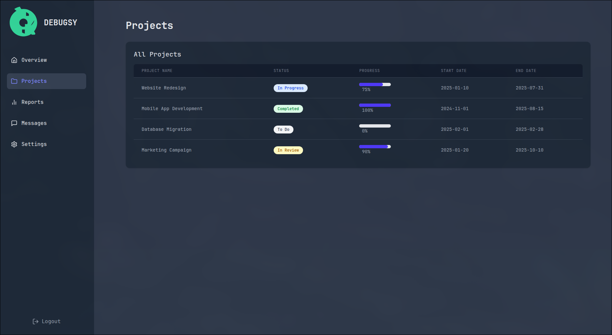
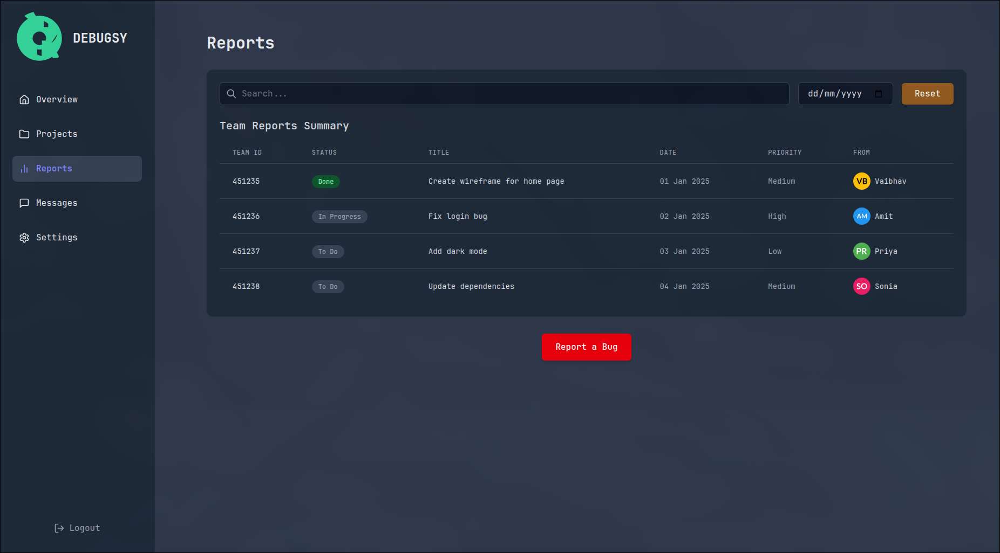
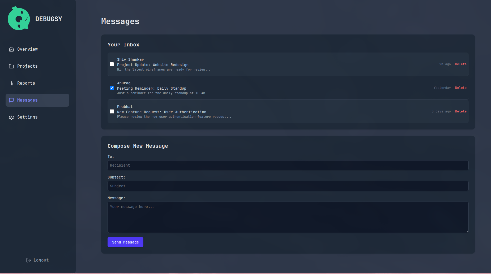
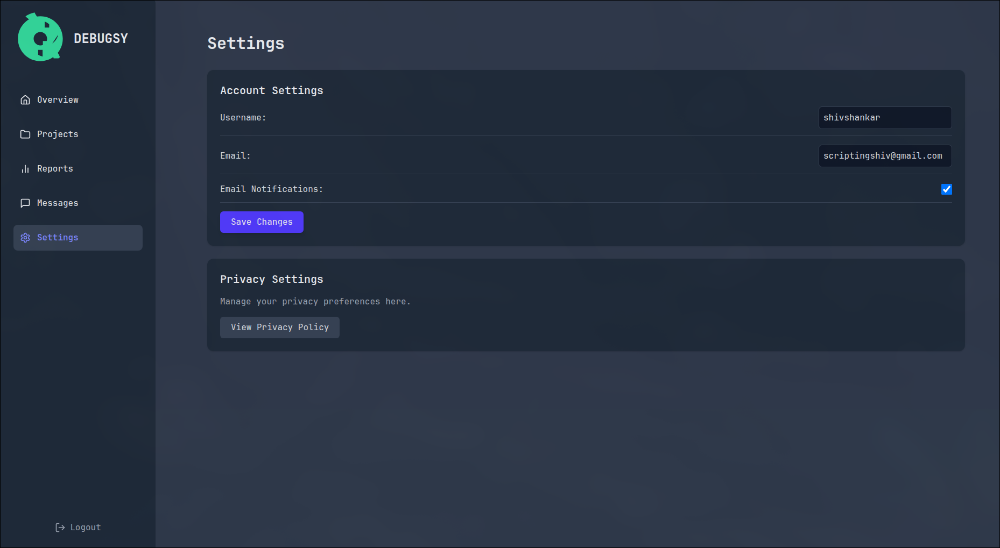
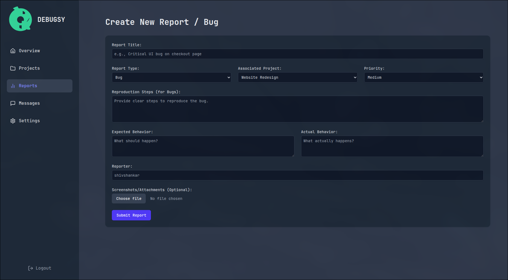
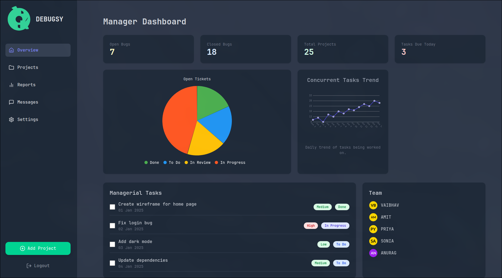
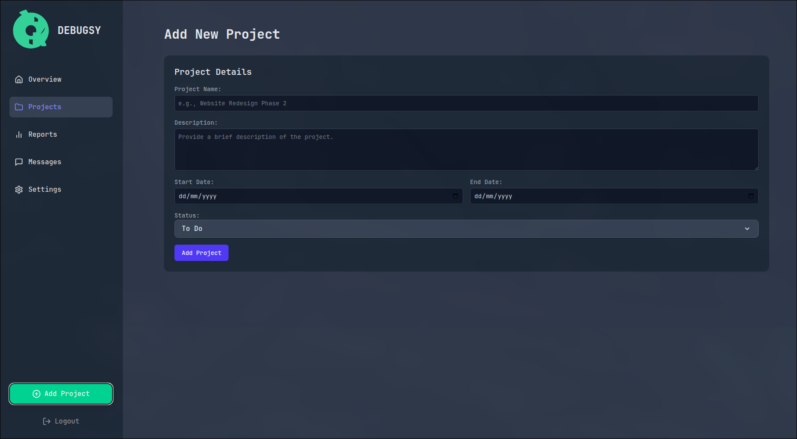

# [Debugsy](https://debugsy.vercel.app/) - Bug/Task Tracker Interface

## 🚀 Project Overview

**Debugsy** is a web-based Bug/Task Tracker application developed to showcase frontend development capabilities using **ReactJS**, **Redux Toolkit**, and **Tailwind CSS**. It features a role-based dashboard with customized interfaces for developers and managers.

---

## 🎯 Assignment Description

This project was built as a frontend development assessment focusing on:

- UI/UX design
- Next.js proficiency
- State management
- Modular architecture

---

## ✅ Core Features

### 👥 User Authentication / Role Management

- Simulated login system with role-switching via sidebar dropdown.
- Dynamic dashboard views based on role (Developer or Manager).

### 📊 Dashboard Highlights

- **Developer View**: Assigned tasks, upcoming deadlines, and recent activity.
- **Manager View**: Key metrics (bug stats, projects, deadlines) and trend analysis.
- Simulated trend line chart for task concurrency.

### 🐞 Task / Bug Creation

- "Create Report" page for developers with fields like title, description, type, project, priority, etc.
- Optional file upload for screenshots (simulated).

### 🗂️ Task / Bug Management

- Displayed in tables with status badges.
- Actions: Edit and Delete (simulated, Redux-only).
- Status: To Do, In Progress, In Review, Done.

### ⏱️ Time Tracker (Simulated)

- UI placeholders available; not implemented.

### 💅 UI/UX

- Tailwind CSS styled, fully responsive.
- Clean and intuitive layout with role-aware navigation.

---

## 🛠️ Technology Stack

- **Frontend**: Next.js
- **State**: Redux Toolkit
- **Styling**: Tailwind CSS
- **Icons**: Lucide React
- **Charts**: SVG and chart.js

---

## 🤖 Assumptions and Simplifications

- Simulated Redux and authentication.
- No persistent backend.
- No file upload storage.
- No real-time communication.
- IDs via `Date.now()`.
- State resets on reload.

---

## 🔍 Areas to Highlight

- Modular Redux slices (user, dashboardMetrics, reports, etc.)
- Dynamic role-based UI rendering
- Component-based architecture
- Form integration with Redux
- Simulated but realistic frontend workflow

---

## 🌱 Future Improvements

- Backend Integration (Node.js, Django, Firebase, etc.)
- Real Authentication (JWT, sessions)
- Real-time updates (WebSocket/Firebase)
- Full CRUD with modals and pagination
- Time tracking system
- Notifications
- File uploads (S3/Firebase)
- User profile system
- Testing (unit, E2E)
- Enhanced error handling & UX

---

## 📦 Deliverables

- GitHub repo with source code
- README
- Screenshots of major features
- Live demo ( Vercel)
- [video walkthrough](https://drive.google.com/file/d/1-FzIyPjojA6WazoS20TKOKWEpjwAXO7O/view?usp=sharing)

---

## 🔗 [Demo](https://debugsy.vercel.app/)

👉 portfolio: [shivshankar.vercel.app](https://shivshankar.vercel.app)

---

© 2025 Shiv Shankar Kushwaha

## 🖼️ Screenshots

<table>
    <tr>
        <td></td>
        <td></td>
        <td></td>
    </tr>
    <tr>
        <td></td>
        <td></td>
        <td></td>
    </tr>
    <tr>
        <td></td>
        <td></td>
        <td></td>
    </tr>
    <tr>
        <td></td>
        <td></td>
        <td></td>
    </tr>
</table>
